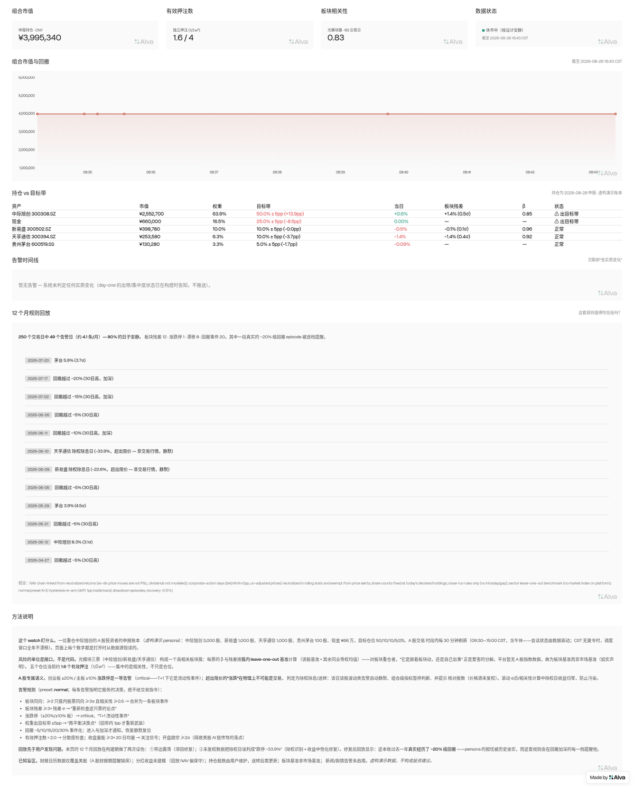
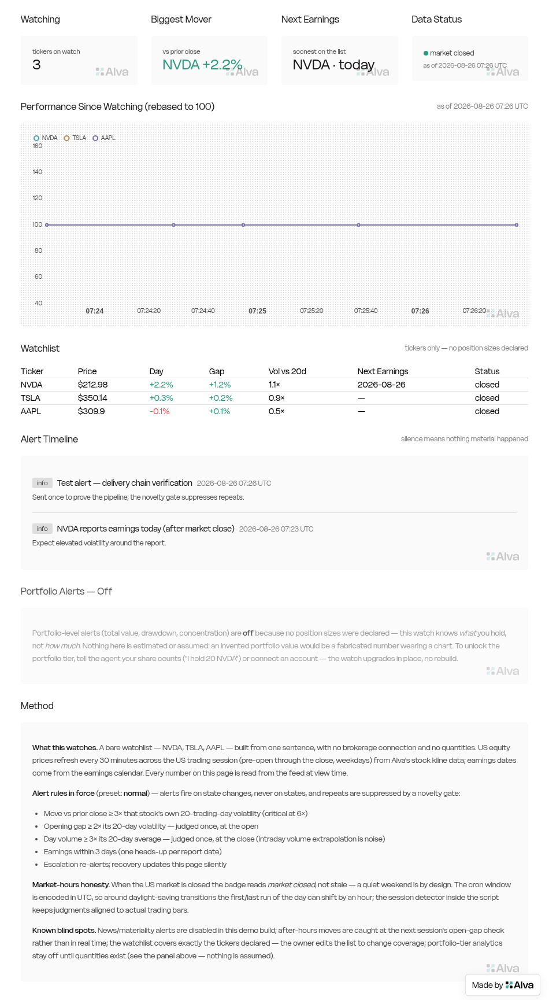

# portfolio-watch — an Alva Agent Skill

Say **"keep an eye on my NVDA, TSLA, and AAPL, ping me when something big
happens"** — or the same about your Binance account — and get a live,
alert-enabled Alva Playbook: session-aware refresh, σ-scaled novelty-gated
alerts, explicit staleness, private-by-default sharing with a data-layer
share-safe mode. Stocks, crypto, or both; a connected account, a declared
holdings list, or just tickers.

This repo is my submission for Alva's PM take-home: *build a Portfolio Watch
Skill that lets any user generate a Playbook with a UI and alerts.*

> **Start here → [做题思路一页纸（中文）](ONE-PAGER.zh.md) · [One-pager (EN)](ONE-PAGER.md)** — the
> approach, the product decisions, and links to the four live demo Playbooks.

## Proof it works — three live builds from one skill

The three demos span the skill's whole input range — a connected account, a
bare watchlist, and a declared book with targets — which is the reusability
claim made concrete.

**Showcase: A-share concentrated-book risk watch** (fictional persona — an
A-share investor heavy in Zhongji Innolight 中际旭创: 3,000×300308.SZ (~64%),
optical-module peers 新易盛/天孚通信, Moutai as the non-AI control, ¥660k
cash, self-declared targets 50/10/10/5/25; declared-holdings mode, zero
blocking questions):

- **Public showcase** (canonical link):
  <https://alva.ai/u/lx79d/playbooks/portfolio-watch-showcase>
- First-principles risk view: **effective bets 1.6 of 4** (the concentration
  is correlation, not just position size — sector corr 0.83), per-stock
  **β/residual against a sector leave-one-out benchmark** (no A-share index
  data on the platform — disclosed, not papered over), correlated co-moves
  collapsed into one sector alert, drift bands on the owner's own targets.
- **A-share semantics as first-class product**: ±20%/±10% price limits are
  critical alerts (a limit day is a liquidity event under T+1);
  **corporate-action detection on un-adjusted prices** (a "−33.9% day" is
  physically impossible trading → ex-div/split, auto-silenced, stats
  neutralized); lunch-break sessions handled data-driven; CST has no DST so
  the cron window never drifts.
- The **12-month replay rendered on the page falsified the design three
  times**: band-edge oscillation → hysteresis re-arm; ex-div days
  masquerading as limit-down crashes → corporate-action handling; and then
  the replay itself was falsified — an architecture experiment showed the
  stand-alone replay's semantics had drifted from live (no novelty-gate
  modeling; residuals judged only at replay's close-runs; live's gap rule
  had no ex-div guard). Fix: **live, replay, and an offline 26-assertion
  test suite now share one pure judgment module**
  ([`demo-ashare/judgment.js`](demo-ashare/judgment.js)) — parity by
  construction. Re-run on real data: **44 alert-days / 250 (~3.7/month,
  quiet 82% of days)** vs the old replay's 49 — the 5-day gap is exactly
  what the old replay promised but live would have suppressed. The **real
  −20% drawdown episode** survives every correction: the persona's fear,
  confirmed by history, alerted band by band. Evidence in
  [`demo-evidence-ashare/`](demo-evidence-ashare/) (the earlier NVDA-persona
  build is preserved in [`demo-evidence-showcase/`](demo-evidence-showcase/)).




**Equity watchlist demo — the assignment's literal sentence** ("keep an eye
on my NVDA, TSLA, and AAPL, ping me when something big happens"; no account,
no quantities → bare-watchlist mode, zero blocking questions):

- **Public demo** (canonical link):
  <https://alva.ai/u/lx79d/playbooks/portfolio-watch-equity-demo>
- Market-hours cron, close-run σ anchor on 20 *trading* days, gap-judged-once,
  volume-at-close, a real earnings-day alert (NVDA reported the day the demo
  was built), portfolio tier **visibly off** — no fabricated NAV — and alert
  digests carrying an **Open Playbook deep-link button**. Per-gate evidence in
  [`demo-evidence-equity/`](demo-evidence-equity/).



**Crypto portfolio demo** — built earlier by the same skill's flow, from one
sentence to a published watch in **33 minutes and 3 user interactions**:

- **Share-safe public demo** (canonical link):
  <https://alva.ai/u/lx79d/playbooks/portfolio-watch-demo-safe>
- Private original (owner view): <https://alva.ai/u/lx79d/playbooks/portfolio-watch-demo>
- Every definition-of-done gate has command-output/screenshot evidence in
  [`demo-evidence/`](demo-evidence/) — including the two-manual-runs history
  check, a forced failure injection (unpriceable asset → carried/stale, **no
  false alert**), the four alert-delivery gates verified one by one, and **one
  test alert delivered exactly once** (`alva alert history`: a single `sent`
  row across two triggers — the novelty gate ate the second).

## Install & use

Drop the skill directory into your agent's skills path (it is a standard
Agent Skill: `SKILL.md` + `references/`). Then say things like:

> watch my portfolio and ping me when something big happens
> how's my portfolio doing today?
> my watch is too chatty, calm it down
> make it public — I want to post the link

The skill routes each to the right shape (Answer / Build / Tune / Share /
Remix / Agent Schedule) instead of over-building.

## Design in one diagram

```
account truth ──► priced snapshot ──► bounded history ──► material-change ──► quiet-by-default ──► live Playbook
(Binance API      (data skills,        (last run · 24h ·    judgment            alerts               (feed-bound,
 or manual list;   fresh discovery;     20d σ · 30d dd;      (σ-scaled moves,    (novelty gate,        staleness
 empty ≠ error;    carried/unpriced     KV fingerprints)     banded drawdown,    escalation-only       visible,
 rung A→D ladder)  are visible states)                       depeg 2-run rule)   re-alerts, digest)    share-safe)
```

Three promises defended everywhere: **the numbers are real** (LLM never a
fact source), **silence is information** (the alert channel's signal rate is
the product), **the page is alive** (feed-bound, staleness never disguised).

## Evidence of quality

| Round | Scenarios | With skill | Without skill | Notes |
|---|---|---|---|---|
| Iteration 1 | 5 | 27/27 | 15/27 (56%) | [report](evals/iteration-1-results.md) |
| Iteration 2 (v2 skill, tightened + 2 new scenarios) | 7 | 40/40 | 26/40 (65%) | [report](evals/iteration-2-results.md) · [benchmark](evals/iteration-2-benchmark.md) |
| Iteration 3 (v3 multi-asset, de-saturated + 2 new scenarios) | 9 | **63/63** | 42/63 (67%) | v2 baseline on the refactor-affected scenarios: 13/19 vs v3's 19/19 — [report](evals/iteration-3-results.md) |
| Iteration 4 (v4 exposure rules: new scenario + regression spot-checks) | 1 new + 2 regression | **8/8** new · 15/15 regression | 3/8 new | Baseline lacks β/residual and factor-event collapse entirely — [report](evals/iteration-4-results.md) |

Assertions are decision-level (declared alert output? bounded history? dust
bucketed? same-run share-safe? config-not-rebuild tune? zero-question
watchlist build? market-closed ≠ stale?), graded by independent agents with
evidence quotes, and were only ever tightened between rounds. The two
scenarios that saturated in iteration 2 now discriminate (8/8 vs 7/8 and
8/8 vs 5/8) — the queued tightenings worked as designed.

Every platform call in the skill was calibrated against the real CLI/SDK —
item-by-item table in [`calibration.md`](calibration.md); anything not
exercisable live is explicitly labeled. Real pits hit during the live build
(private-visibility 503, one-cronjob-one-feed 500, screenshot-vs-private
auth) are documented, not hidden — see `DESIGN.md` and `demo-evidence/e2e-log.md`.

## Repo map

| Path | What it is |
|---|---|
| `SKILL.md` | The skill: routing, dialect, source resolution, defaults, workflow, hard gates |
| `references/portfolio-source.md` | Source modes (account / declared / watchlist), degradation ladder, mixed portfolios |
| `references/asset-equity.md` | Equity module: sessions, change semantics, gap/earnings/volume kinds |
| `references/asset-crypto.md` | Crypto module: Binance scope, pair resolution, 24/7 cadence, depeg (formerly `binance-portfolio.md`) |
| `references/feed-contract.md` | Feed schema (calibrated), time semantics, KV, bounded history |
| `references/producer.md` | Producer template (calibrated), judgment windows, failure discipline, the LLM's cage |
| `references/alerts.md` | Taxonomy, presets, novelty gate, delivery chain (four gates) |
| `references/playbook-ui.md` | Layout contract (incl. watchlist variant), release chain, share-safe, remix |
| `ONE-PAGER.md` / `ONE-PAGER.zh.md` | The thinking, on one page (EN / 中文) |
| `calibration.md` | Skill vs. real platform, item by item (`calibration-raw/` = raw help tree) |
| `demo-ashare/` | A-share showcase source of truth: shared judgment module (live = replay = tests), build script, 26-assertion offline suite |
| `demo/` | The crypto demo's producer + both playbook pages, as deployed |
| `demo-evidence/` | Crypto demo: per-gate command outputs, screenshots, e2e log |
| `demo-evidence-equity/` | Equity demo: per-gate evidence for the assignment's literal sentence |
| `demo-evidence-ashare/` | A-share showcase: sector residuals, price-limit/corporate-action semantics, replay double-falsification |
| `demo-evidence-showcase/` | Earlier NVDA-persona showcase build (superseded, preserved as evidence) |
| `evals/` | All four eval rounds: prompts, assertions, results, benchmarks |
| `DESIGN.md` | 中文产品设计说明：判断、取舍、指标、实地裁决与踩坑记录 |
