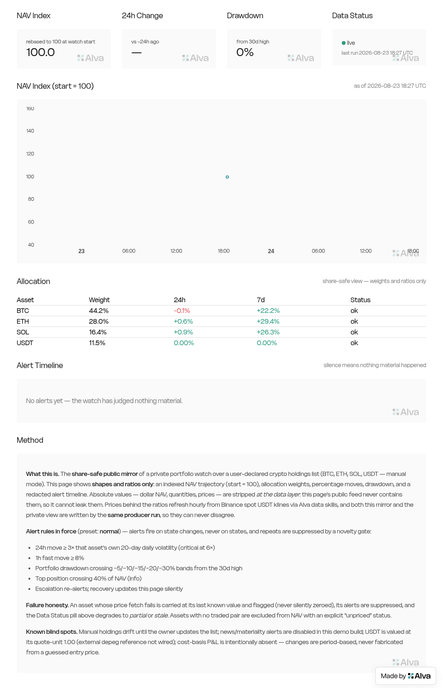

# portfolio-watch — an Alva Agent Skill

Say **"watch my crypto portfolio and alert me when something big happens"** —
get a live, alert-enabled Alva Playbook: hourly-refreshed holdings, σ-scaled
novelty-gated alerts, explicit staleness, private-by-default sharing with a
data-layer share-safe mode.

This repo is my submission for Alva's PM take-home: *build a Portfolio Watch
Skill that lets any user generate a Playbook with a UI and alerts.*

## Proof it works — live demo

Built on the real platform by this skill's flow, from one sentence to a
published watch in **33 minutes and 3 user interactions** (the sentence, one
blocking question, one share-safe release confirmation):

- **Share-safe public demo** (canonical link):
  <https://alva.ai/u/lx79d/playbooks/portfolio-watch-demo-safe>
- Private original (owner view): <https://alva.ai/u/lx79d/playbooks/portfolio-watch-demo>
- Every definition-of-done gate has command-output/screenshot evidence in
  [`demo-evidence/`](demo-evidence/) — including the two-manual-runs history
  check, a forced failure injection (unpriceable asset → carried/stale, **no
  false alert**), the four alert-delivery gates verified one by one, and **one
  test alert delivered exactly once** (`alva alert history`: a single `sent`
  row across two triggers — the novelty gate ate the second).



## Install & use

Drop the skill directory into your agent's skills path (it is a standard
Agent Skill: `SKILL.md` + `references/`). Then say things like:

> watch my portfolio and ping me when something big happens
> how's my portfolio doing today?
> my watch is too chatty, calm it down
> make it public — I want to post the link

The skill routes each to the right shape (Answer / Build / Tune / Share /
Remix / Agent Schedule) instead of over-building.

## Design in one diagram

```
account truth ──► priced snapshot ──► bounded history ──► material-change ──► quiet-by-default ──► live Playbook
(Binance API      (data skills,        (last run · 24h ·    judgment            alerts               (feed-bound,
 or manual list;   fresh discovery;     20d σ · 30d dd;      (σ-scaled moves,    (novelty gate,        staleness
 empty ≠ error;    carried/unpriced     KV fingerprints)     banded drawdown,    escalation-only       visible,
 rung A→D ladder)  are visible states)                       depeg 2-run rule)   re-alerts, digest)    share-safe)
```

Three promises defended everywhere: **the numbers are real** (LLM never a
fact source), **silence is information** (the alert channel's signal rate is
the product), **the page is alive** (feed-bound, staleness never disguised).

## Evidence of quality

| Round | Scenarios | With skill | Without skill | Notes |
|---|---|---|---|---|
| Iteration 1 | 5 | 27/27 | 15/27 (56%) | [report](evals/iteration-1-results.md) |
| Iteration 2 (v2 skill, tightened + 2 new scenarios) | 7 | **40/40** | 26/40 (65%) | [report](evals/iteration-2-results.md) · [benchmark](evals/iteration-2-benchmark.md) |

Assertions are decision-level (declared alert output? bounded history? dust
bucketed? same-run share-safe? config-not-rebuild tune?), graded by
independent agents, and were only ever tightened between rounds. Two new
scenarios saturated — the graders' own critiques are queued as iteration-3
tightenings in the report.

Every platform call in the skill was calibrated against the real CLI/SDK —
item-by-item table in [`calibration.md`](calibration.md); anything not
exercisable live is explicitly labeled. Real pits hit during the live build
(private-visibility 503, one-cronjob-one-feed 500, screenshot-vs-private
auth) are documented, not hidden — see `DESIGN.md` and `demo-evidence/e2e-log.md`.

## Repo map

| Path | What it is |
|---|---|
| `SKILL.md` | The skill: routing, dialect, defaults, workflow, hard gates |
| `references/binance-portfolio.md` | Account truth, scope, symbol resolution, degradation ladder |
| `references/feed-contract.md` | Feed schema (calibrated), time semantics, KV, bounded history |
| `references/producer.md` | Producer template (calibrated), failure discipline, the LLM's cage |
| `references/alerts.md` | Taxonomy, presets, novelty gate, delivery chain (four gates) |
| `references/playbook-ui.md` | Layout contract, release chain, share-safe mechanics, remix |
| `calibration.md` | Skill vs. real platform, item by item (`calibration-raw/` = raw help tree) |
| `demo/` | The live demo's producer + both playbook pages, as deployed |
| `demo-evidence/` | Per-gate command outputs, screenshots, e2e log with timings |
| `evals/` | Both eval rounds: prompts, assertions, results, benchmark |
| `DESIGN.md` | 中文产品设计说明：判断、取舍、指标、实地裁决与踩坑记录 |
